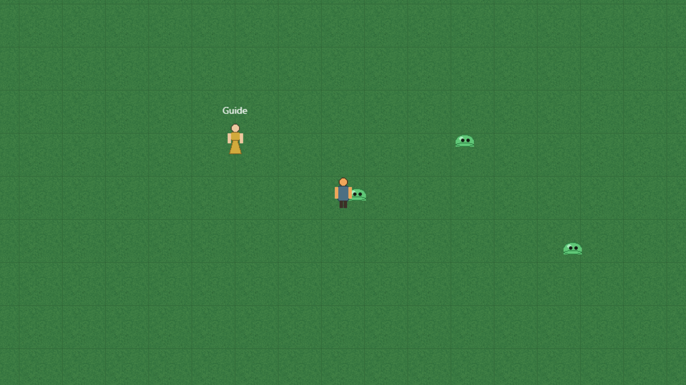
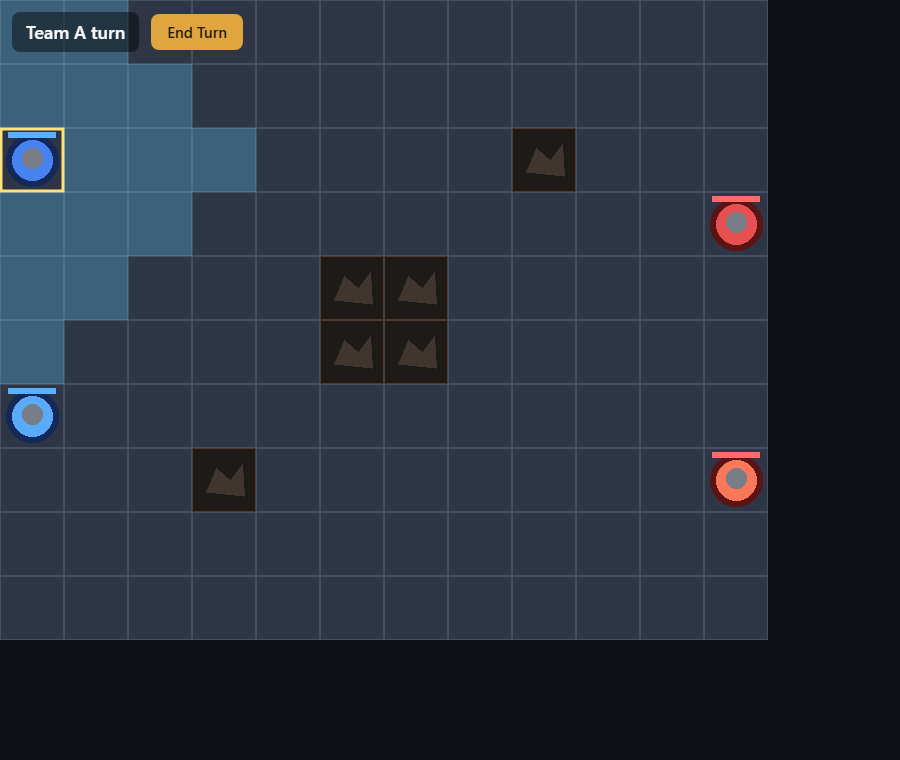
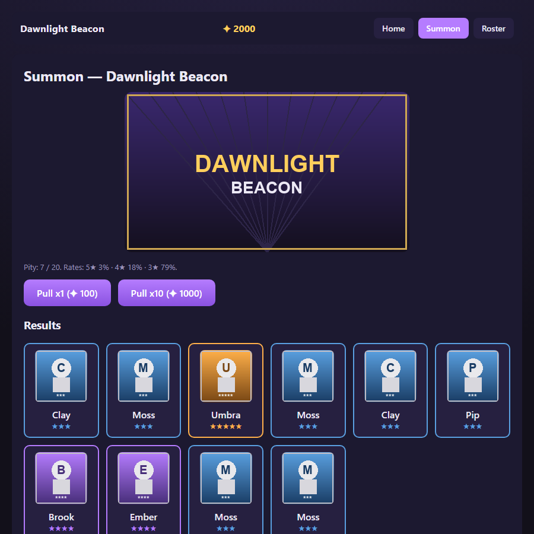

# Genres — start any genre from a reference game

GameKit ships **three self-contained, forkable reference games** under [`examples/`](../examples/).
They exist to prove the same toolkit conventions (isolated `pnpm install --ignore-workspace`, a
`#auth-guest` "Play as Guest" entry, an inspectable `globalThis.__*`, a server boot log echoing
`GAMEKIT_SMOKE_RUN_ID`, an extracted pure engine) carry **three different genres** — real-time,
turn-based, and request/response — with no shared runtime assumption. Pick the one closest to your
game, fork it, and grow.

Each is a **separate project** (its own `node_modules`), so the game-aware tools run against it with
`cwd = <that game's folder>`. None of them mutate the others; `pnpm create:game <name>` forks the
real-time starter specifically (see [Pick your starting point](#pick-your-starting-point)).

---

## The three starters at a glance

| | [starter-game](../examples/starter-game/) | [tactics-game](../examples/tactics-game/) | [gacha-game](../examples/gacha-game/) |
|---|---|---|---|
| **Genre** | Real-time action (action MMO / roguelike feel) | Turn-based grid tactics (Fire Emblem / Advance Wars) | Gacha / collection (mobile summon banner) |
| **Server pattern** | **Real-time room** — Colyseus room `"game"`, per-tick sim, state sync | **Authoritative-turn** — Colyseus room `"game"`, no tick; state mutates only on validated intents | **Request/response HTTP** — Express API, no room/socket, no tick |
| **Client / UI** | **Phaser world** — camera-followed scene, sprites, tiled ground | **Phaser grid** — 12×10 board, tile highlights, unit tokens | **DOM screens** — a screen router (Home / Summon / Roster); ~70% UI |
| **Input** | WASD / click-to-move (`move.to` intent) | Click a unit → click a highlighted tile / adjacent enemy (`move` / `attack` / `endTurn` intents) | Button clicks (`Pull x1` / `Pull x10`, screen nav) → HTTP POST |
| **Authority** | Server owns positions; clients send movement intent | Server validates every intent vs. whose turn it is + legal ranges; rejects illegal | Server owns currency / roster / pity; validates + spends before pulling; `402` if unaffordable |
| **Extracted engine** | *(none — the real-time room + contract IS the demo)* | [`@tactics/turn-grid`](../examples/tactics-game/packages/turn-grid/) — BFS reachable-tiles, team rotation, move/attack validation | [`@gacha/summon`](../examples/gacha-game/packages/summon/) — seeded RNG, weighted rarity table, hard pity, pure reducers |
| **Inspectable global** | `globalThis.__GAME` (scene `"game"`, `room.state.players`, `playerObjects`) | `globalThis.__GAME` (scene `"game"`, `room`, live `board` + `units`) | `globalThis.__GACHA` (`token`, `banner`, `state`, `screen`, `lastResults`) |
| **Screenshot** |  |  |  |
| **Fork it** | `pnpm create:game <name>` (copies this template) | copy `examples/tactics-game/` → your repo | copy `examples/gacha-game/` → your repo |

Every starter reuses the reference conventions **exactly** — the only thing that differs is the
runtime *shape*. That is the whole point: the kit is a genre-agnostic baseline, not an action engine
with turn-based bolted on.

---

## Pick your starting point

Map the game you want to a starter, then add the genre-specific pieces. Be honest about what the
fork gives you for free versus what you still build.

### Online pixel tactics → fork `tactics-game`

**Fork gives you:** the authoritative-turn Colyseus room, the Phaser grid renderer with move-range
highlights, team rotation, and the pure [`@tactics/turn-grid`](../examples/tactics-game/packages/turn-grid/)
engine (BFS reachable-tiles + move/attack validation, unit-tested). The server-truth-matches-client
guarantee is by construction — both ends import the same validation module, so highlighted tiles
are exactly the legal moves.

**You build:** unit classes / stats / abilities (the demo has one melee attack), multiple maps
(the demo has one 12×10 board), terrain effects, ranged/AoE attack shapes (extend `validateAttack`),
win/loss beyond "last team standing", and real art for the placeholder unit/tile PNGs.

### Gacha mobile → fork `gacha-game`

**Fork gives you:** the request/response Express API (guest session, `GET /api/state`,
authoritative `POST /api/summon` with currency spend + `402`), the DOM screen router (Home / Summon
/ Roster), and the pure [`@gacha/summon`](../examples/gacha-game/packages/summon/) engine (seeded RNG,
weighted rarity table, hard pity, roster/currency bookkeeping, unit-tested for rate accuracy over
20 000 pulls). Drop rates can never disagree between server and client — both import the one table.

**You build:** touch input + a portrait / responsive layout (the demo is desktop DOM), more banners
(the demo ships one — `banner.ts` is the seam), a persistence layer (state is in-memory per guest),
a **battle screen** to actually use the units you collect, and real unit / banner art.

### Action MMO / roguelike → fork `starter-game`

**Fork gives you:** the real-time Colyseus room with per-tick state sync, `move.to` intent, a
camera-followed Phaser world, tiled-ground asset pipeline (promoted-registry → layout → texture),
server-spawned entities (slimes), and full compatibility with **every** game-aware toolkit tool
(`capture:zone`, `smoke:client`, `zone:*`) out of the box — this is the template `pnpm create:game`
clones. **Fork it with:** `pnpm create:game my-rpg`.

**You build:** combat / damage / death, monster AI, inventory / loot / quests (the smoke state
reader already expects these fields — see [`tools/src/smoke/state.ts`](../tools/src/smoke/state.ts)),
multiple zones + portals, and real art. This is the heaviest fork but the most tool-supported.

---

## Reusable systems the kit ships

These are the pure, testable horizontals a fork brings along. See [systems.md](systems.md) for the
full catalog (where each lives, what it does, why forking the template carries it).

| System | Lives in | Pure of | What it gives |
|---|---|---|---|
| [`@gamekit/game-contract`](../packages/game-contract/) | top-level `packages/` | — (types + generic algos) | the spatial content contract the capture/zone/smoke tools read a game through |
| [`@tactics/turn-grid`](../examples/tactics-game/packages/turn-grid/) | inside tactics-game | Phaser, Colyseus | grid + BFS reachable-tiles, team rotation, move/attack validation |
| [`@gacha/summon`](../examples/gacha-game/packages/summon/) | inside gacha-game | Express, DOM | seeded RNG, weighted rarity + hard pity, pure pull reducers |
| Real-time room pattern | starter-game `server/` | — | Colyseus room, per-tick sync, `move.to` intent |
| Authoritative-turn pattern | tactics-game `server/` | — | Colyseus room, no tick, intent-validated mutation |
| Request/response pattern | gacha-game `server/` | — | Express JSON API, session token, no socket |

**Honest note on where the engines live:** `turn-grid` and `summon` live **inside their templates**,
not as shared top-level `packages/*`. That is deliberate — a fork must be self-contained and
copy-portable, so the genre engine ships *with* the game you clone rather than as an external
dependency you have to also vendor. Each is written pure (no framework deps) and could later
graduate to a top-level `packages/*` if a second genre needs it, but until then keeping it in the
fork is the feature, not a gap.

---

## Known limitation / roadmap — the smoke/capture reader is action-only

The toolkit's smoke/capture state reader ([`tools/src/smoke/state.ts`](../tools/src/smoke/state.ts))
is **action-oriented**: it reads a Colyseus `scene.room.state.players` keyed by `sessionId`,
`scene.playerObjects`, and real-time fields (`hp/mp/xp/inventory/quests`, `monsters[]`). Both
turn-based and request/response genres hit the same wall:

- **tactics-game** has no `players`-by-session — its entities are `units[]` keyed by `unitId` and
  owned by a *team*. The action capture tool finds zero players/playerObjects.
- **gacha-game** has no Colyseus room at all — its inspectable state is `globalThis.__GACHA`
  (currency / roster / banner) behind an HTTP API, and its guest handshake is a `POST`, not a room
  join.

So `pnpm capture:zone` / `pnpm smoke:*` fully drive **only** the real-time starter today. Both
alternative genres stay inspectable anyway (each exposes a genre-appropriate global), and both were
verified with a small standalone Playwright drive (the `_shots/` each game produced at build).

**Roadmap:** a **turn-based smoke sibling** (read `units[]`-by-team instead of players-by-session)
and a **request/response smoke sibling** (read the HTTP `state` / `__GACHA` instead of a room) would
let those two genres use the capture/smoke tooling. This is the intended finding — the genres fit
the *conventions*; only the one action-specific tool needs siblings. We deliberately did **not**
modify `tools/` to force a fit.
